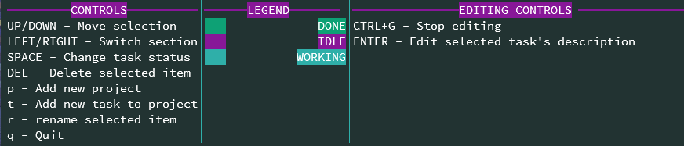

# Terminal Project Management
by Sem van der Hoeven

## Contents

- [Overview](#Overview)
- [Installation](#Installation)
- [Usage](#Usage)
- [Features to be added](#Features-to-be-added)
- [How to contribute](#How-to-contribute)

# Overview
This is a project management tool straight from your terminal!
It is written in python using the [curses library](https://docs.python.org/3/library/curses.html).

It gives a neat presentation of all your projects, which you can assign tasks to, which all have a unique status and description. This gives you an overview of the project's progress at a glance.

# Installation

### requirements:
- python 3.x

Download the file from the [releases page](https://github.com/SemvdH/terminal-project-management/releases) and run `python tpm.py`

# Usage
The tool is made to be used in a side window, preferably half the size of your screen, but it works in all 
window sizes.

The application is navigated using the arrow keys and certain shortcut keys. The controls are also listed at the bottom of the application:

     
 - up / down arrow - move selection
    - this selects a different project or task
 - left / right arrow - switch section
    - this switches between selecting tasks or projects
 - space - change task status
    - there are 4 states a task can be in: Done, Idle, Working and no state. By default all newly added tasks are in No state but you can cycle through these using the space bar.
 - delete key - deletes selected project or task.
 - p - adds a new project
 - t - adds a new task to the currently selected project
 - r - rename selected project or task
 - q - exit the application

All tasks also have a description which can be edited. You can begin editing a task's description by selecting it and pressing the enter key. When you're done editing, press ctrl + G to stop editing. The application automatically saves your changes to the `data` file.

# Features to be added
- Color themes
- Custom task states
- Custom task colors
- Project-specific color themes
- Exporting of project to text file

# How to contribute
If you would like to contribute to this project, you can fork it and make a pull request with the changes you would like to have added.